# Project Wiring Diagram — Level 1

> This is the single source of truth for the project architecture.
> Every node below maps to a section of the codebase.
> The admin `/map` page renders this visually.
> **To focus a session on one node**, reference it by name — e.g. "let's work on Lead Reply today".

---

## Top-Level Diagram

```mermaid
graph TD
    Auth["🔐 Auth\n(planned)"]
    Portal["📱 Client Portal\n(in-progress)"]
    Admin["⚙️ Admin Panel\n(in-progress)"]
    Automations["🤖 Automations Engine\n(in-progress)"]
    Knowledge["🧠 Knowledge Hub\n(in-progress)"]
    Payments["💳 Payments\n(in-progress)"]

    Auth -->|guards| Portal
    Auth -->|guards| Admin
    Admin -->|configures| Portal
    Admin -->|manages| Knowledge
    Knowledge -->|feeds context| Automations
    Portal -->|renders tab| Automations
    Portal -->|checkout| Payments
    Payments -->|confirms| Portal
```

---

## NODE: Auth

**Status:** `planned` (security issues unresolved)
**Description:** Two separate auth systems — client PIN login and admin Bearer token.
**What works:** Login flow exists, sessions stored in sessionStorage.
**What's broken:** PINs stored plaintext, admin token is base64-reversible, no rate limiting.

### Sub-nodes
- Client PIN Auth (`app/api/verify-pin/route.ts`)
- Admin Bearer Token (`lib/admin-auth.ts`, `app/api/admin/auth/route.ts`)

### Target state
- Client PIN hashed with bcrypt
- Admin token is a real JWT with expiry
- Rate limiting on both endpoints (10 req/min)
- Auth failures logged to audit table

### Key files
- `lib/admin-auth.ts`
- `app/api/verify-pin/route.ts`
- `app/api/admin/auth/route.ts`

### Changelog
- Initial: Basic PIN check, session stored in sessionStorage
- Stripe webhook idempotency table added (unrelated to auth, but same session)

---

## NODE: Client Portal

**Status:** `in-progress`
**Description:** The branded dashboard each client sees at `getd.dk/[slug]`. PIN-protected, fully themed with client colors.
**What works:** All 6 tabs render, branding applies via CSS variables, i18n across 8 languages.
**What's missing:** Some tabs thin on data (Demand tab needs keyword data, Assets tab needs uploads).

### Sub-nodes
- Sales Tab (`components/tabs/sales-tab.tsx`)
- Demand Tab (`components/tabs/demand-tab.tsx`)
- Activity Tab (`components/tabs/activity-tab.tsx`)
- Assets Tab (`components/tabs/assets-tab.tsx`)
- Automations Tab (`components/tabs/automations-tab.tsx`) — surface for Automations Engine
- Execution Tab (`components/tabs/execution-tab.tsx`)

### Target state
- Each tab is polished and self-explanatory for Thomas / Casper
- Correct tabs visible per client archetype (`is_visible` flag)
- Automations tab shows live status + approval queue for Casper
- Execution tab handles both one-time payments and subscriptions cleanly

### Key files
- `app/[slug]/page.tsx`
- `components/client-app.tsx`
- `components/tabs/`

### Changelog
- Locale hardcoding fixed (da-DK was hardcoded — now uses `langToLocale()` helper)
- Tab visibility flag (`is_visible`) implemented
- URL routing: `/admin/[clientId]/[section]` instead of state-based navigation

---

## NODE: Admin Panel

**Status:** `in-progress`
**Description:** Victor's workspace. Client list, per-client editor with all 6 tabs, Knowledge Bank, branding.
**What works:** Full CRUD for all sections, tab visibility toggle, Knowledge Bank with extraction.
**What's missing:** Team access (single password only), audit logs.

### Sub-nodes
- Admin Dashboard (`components/admin/admin-dashboard.tsx`)
- Client Editor (`components/admin/client-editor.tsx`)
- Knowledge Bank editor (`components/admin/editors/knowledge-editor.tsx`)
- Branding editor (`components/admin/editors/branding-editor.tsx`)
- Health Check (`components/admin/health-check.tsx`)

### Target state
- Multi-user access: Victor (full) + team members (scoped)
- Audit log: who changed what and when
- Project Map page (this page!) — visual architecture overview
- Knowledge Hub → auto-fill pipeline works end-to-end

### Key files
- `app/admin/page.tsx`
- `app/admin/[clientId]/[section]/page.tsx`
- `components/admin/`

### Changelog
- Admin URL routing changed from state-based to `/admin/[clientId]/[section]`
- Tab visibility (`is_visible`) toggle added per section
- `creatableSections` now only offers `ACTIVE_TAB_KEYS` — legacy tabs hidden
- New clients auto-seeded with 6 tabs on creation

---

## NODE: Automations Engine

**Status:** `in-progress`
**Description:** AI-powered automations running in TypeScript on Vercel. WAT pattern: Workflow + Agent + Tools.
**What works:** Architecture scaffolded, base interface defined, registry pattern in place.
**What's missing:** Lead Reply and the other two automations need to be production-tested end-to-end.

### Sub-nodes (each is its own Level 2 diagram)
- Lead Reply (`lib/automations/lead-reply/`)
- Social Poster (`lib/automations/social-poster/`)
- Review Collector (`lib/automations/review-collector/`)

### Target state
- All three automations fully working on Casper's account
- Approval queue: drafts stored in `automation_runs` with `status: pending_approval`
- Client sees approval queue in Automations tab
- Notification email sent when draft is ready for review
- Each automation has voice samples from Knowledge Bank

### Key files
- `lib/automations/base.ts` — interface
- `lib/automations/registry.ts`
- `lib/automations/lead-reply/` — index.ts, workflow.ts, tools.ts
- `app/api/automations/[key]/trigger/route.ts`
- `scripts/003_automation_runs.sql`

### Skills
- `/new-automation` — scaffold a new automation
- `/qa` — check automations section

### Changelog
- n8n completely dropped, replaced with TypeScript WAT pattern
- `automation_runs` table designed (SQL ready, not yet applied)
- Approval mode scaffolded: `require_approval` config flag, `pending_approval` status
- Draft notification email (`lib/email.ts`) added — notifies `config.notify_email` when draft ready

---

## NODE: Knowledge Hub

**Status:** `in-progress`
**Description:** Admin-only scratchpad per client. Victor types in facts; AI extracts structured data; that data feeds automations and auto-fill.
**What works:** Entry CRUD, extraction pipeline (AI parses raw text → structured JSON), auto-fill for tabs.
**What's missing:** Linking voice samples from Knowledge Hub directly into automation config UI.

### Sub-nodes
- Entry management (create / edit / delete raw content)
- Extraction pipeline (`app/api/admin/clients/[id]/knowledge/extract/route.ts`)
- Auto-fill (`app/api/admin/clients/[id]/knowledge/autofill/route.ts`)

### Target state
- Voice samples in Knowledge Hub automatically populate automation `voice_samples` config
- Knowledge Hub → content generation: KW research + URL structure + facts → landing page copy draft
- Gap analysis: shows which key facts are missing per client

### Key files
- `app/api/admin/clients/[id]/knowledge/`
- `lib/ai-config.ts` — `getClientAIContext()` (feeds all AI features)
- `components/admin/editors/knowledge-editor.tsx`

### Changelog
- `getClientAIContext()` added: single function that fetches client objective + all extracted facts
- Auto-fill and extraction both use `aiModel()` helper from `lib/ai-config.ts`

---

## NODE: Payments

**Status:** `in-progress`
**Description:** Stripe one-time payments and subscriptions. Embedded checkout in the Execution tab.
**What works:** One-time checkout, subscription checkout, webhook handler with all key events, idempotency.
**What's broken:** Prices read from JSONB (exploitable — needs a server-side price table).

### Sub-nodes
- One-time Checkout (`app/api/checkout/route.ts`)
- Subscriptions (`app/api/subscribe/route.ts`)
- Stripe Webhook (`app/api/webhooks/stripe/route.ts`)

### Target state
- Prices stored in a `price_catalog` table, not read from client request
- Webhook handler covers all required events (done)
- Idempotency guard prevents double-processing (done — `stripe_webhook_events` table)
- Subscription invoices stored and visible to client

### Key files
- `app/api/checkout/route.ts`
- `app/api/subscribe/route.ts`
- `app/api/webhooks/stripe/route.ts`

### Changelog
- Idempotency guard added: `stripe_webhook_events` table, atomic insert, `23505` = duplicate skip
- Subscription events handled: `invoice.paid`, `invoice.payment_failed`, `customer.subscription.deleted/updated`
- `checkout.session.completed` handles both one-time and subscription modes

---

## Planned Nodes (not yet started)

| Node | Description | Priority |
|------|-------------|----------|
| Approval Queue | Client-facing queue for reviewing automation drafts | High (needed for Casper) |
| Admin Team Access | Multi-user admin with roles | Medium |
| SaaS Licensing | White-label for other agencies | Low (future) |
| Content Generation | KW + URL + Knowledge Hub → copy drafts | Medium |

---

## Update Protocol

When significant work is done on any node, update:
1. The node's `Status` field
2. The `Changelog` with what changed (one bullet per session)
3. The `Target state` if the definition of done changes
4. The `Planned Nodes` table when a new node is confirmed

Claude will update this file at the end of focus sessions on a specific node.
